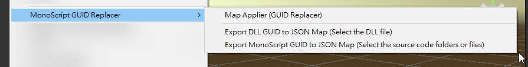
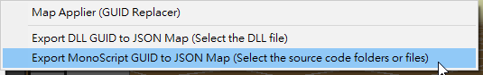
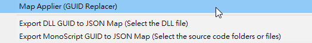
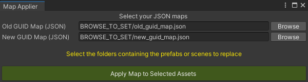

## Language

- [EN](READMEs/EN/README.md)

## 工具介紹

不管專案原本使用 MonoScript Source Code 掛載組件，又或者使用 DLL 掛載組件，都可以生成 MonoScript Source Code 與 DLL 的 GUID 映射表，再透過 GUID 映射表進行 `.prefab` 或 `.unity` 組件 GUID 的替換。

### 安裝說明

| Install via git URL |
|:-|
| Add https://github.com/michael811125/MonoScriptGuidReplacer.git to Package Manager |

### 使用說明

右鍵 -> 菜單 -> MonoScript GUID Replacer

- 輸出 MonoScript Source Code GUID 映射表
  
  
- 輸出 DLL GUID 映射表
  
  
- 開始替換
  
  
  
  | 原本使用 MonoScript | 移除 MonoScript (遺失) | 替換使用成 DLL |
  | :-: | :-: | :-: |
  |  |  |  |
  
---

### Unity 版本

建議使用 Unity 2022.3.59f1(LTS) or higher 版本 - [Unity Download](https://unity3d.com/get-unity/download/archive)

---

### Donate

---

## License

This library is under the MIT License.
