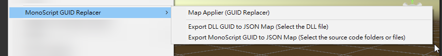
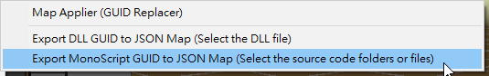
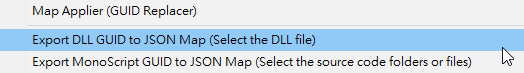
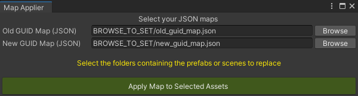
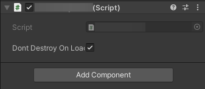
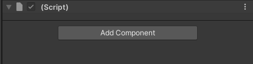
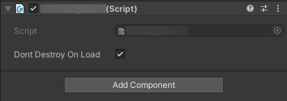

## Tool Introduction

Whether your project originally used MonoScript source code–attached components or DLL–attached components, you can generate a GUID mapping table between MonoScript source code and DLL, and then use the GUID mapping table to replace component GUIDs in `.prefab` or `.unity` files.

### Installation

| Install via Git URL |
|:-|
| Add `https://github.com/michael811125/MonoScriptGuidReplacer.git` to the Package Manager |

### Usage

Right-click → Menu → **MonoScript GUID Replacer**

- Export MonoScript Source Code GUID Mapping Table  
  - 
  
- Export DLL GUID Mapping Table  
  - 
  
- Start Replacement  
  -   
  - 
  -
  | Originally Using MonoScript | MonoScript Removed (Missing) | Replaced with DLL |
  | :-: | :-: | :-: |
  |  |  |  |
  
---

### Unity Version

Recommended: Unity **2022.3.59f1 (LTS)** or higher — [Unity Download Archive](https://unity3d.com/get-unity/download/archive)

---

### Donate

---

## License

This library is released under the MIT License.